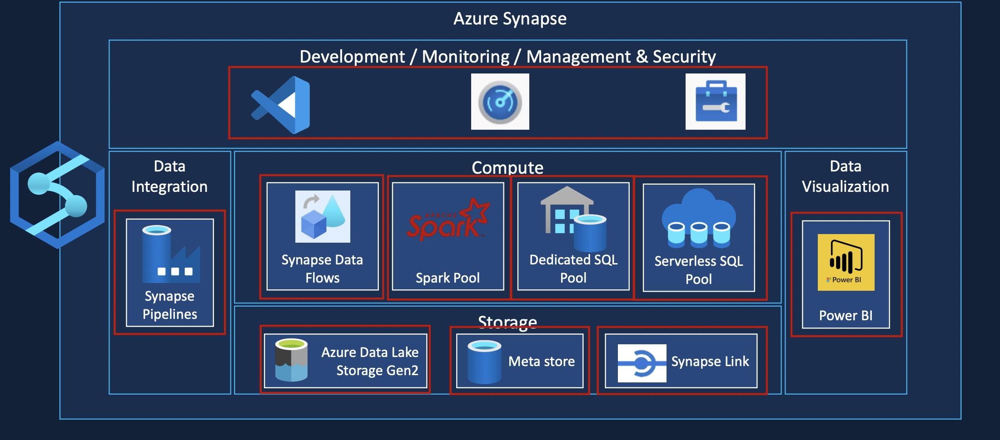

# Azure Synapse Analytics Project

## Project Summary

This project demonstrates a solution for managing and analyzing taxi data using Azure Synapse Analytics. It covers data ingestion, transformation, and reporting, leveraging Azure Synapse to handle data from the Taxi and Limousine Commission website.

## Solution Architecture

### Compute Options

- **Serverless SQL Pool**: Used for querying and processing data on a pay-per-query basis, suitable for scenarios without dedicated resources.

### Data Storage and Layers

- **Raw Data (Bronze Layer)**:
  - Data was initially stored in Azure Data Lake Storage Gen2 (ADLS Gen2).
  - Bronze schema tables were created from this raw data for initial exploration.

- **Ingested Data (Silver Layer)**:
  - Data processed from the Bronze Layer and stored in Parquet format with schemas applied.
  - Created partitions and external tables/views for easier access.

- **Aggregated Data (Gold Layer)**:
  - Data aggregated for business insights and reporting.
  - Available through external tables/views for querying and reporting.

### Data Discovery and Exploration

- Used Serverless SQL Pool to explore raw data and create external tables and views.

### Transformation

- Transformed data in the Silver Layer and aggregated it into the Gold Layer using Serverless SQL Pool.

### BI Reporting

- Utilized Power BI for reporting from the Gold Layer.
- Integrated Power BI Desktop and Power BI within Synapse Studio for visualizations.

### Scheduling and Monitoring

- Implemented Synapse Pipelines for regular scheduling and monitoring of data processes.
- Set up alerts for failure notifications.

## Tools Used

- **Azure Synapse Analytics**
- **Azure Data Lake Storage Gen2 (ADLS Gen2)**
- **Serverless SQL Pool**
- **Power BI**
- **Synapse Pipelines**
